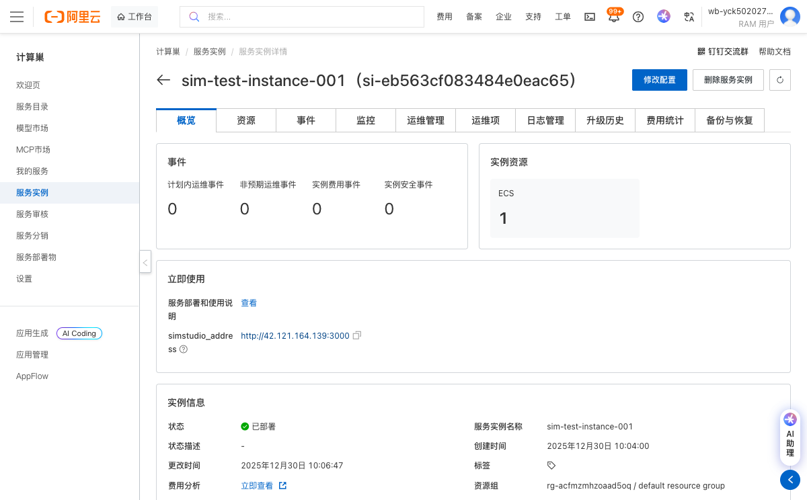
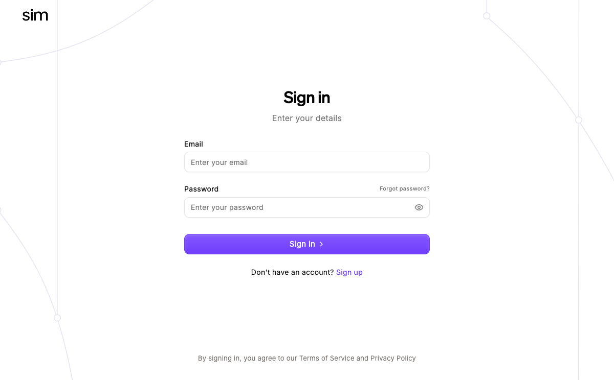

# Sim 社区版服务实例使用文档

## 概述
Sim 是 Sim Studio 平台的核心运行时引擎或智能体执行框架。它不是一个完整的图形界面工具，而是支撑 Sim Studio 前端（如 Web UI）背后 AI Agent 工作流执行、工具调用、记忆管理与多智能体协作的后端服务。

## 部署操作流程
1. 点击链接：[部署链接](https://computenest.console.aliyun.com/service/simple/deploy?ServiceId=service-3cbf3674ca1d43a29a0d)，进入服务实例部署界面，根据界面提示，填写参数。

    )

2. 查看价格明细，确认资源配置和费用信息。

3. 点击"下一步：确认订单"按钮进入下一步。

4. 点击创建实例，系统将开始部署服务实例。

5. 等待服务实例创建完成，可在实例详情页面查看部署状态。
   

6. 点击公网访问地址使用服务（实际地址将在实例创建完成后显示）。
   

## 官方网站
更多信息请访问官方文档：[官网链接](https://docs.sim.ai/introduction)